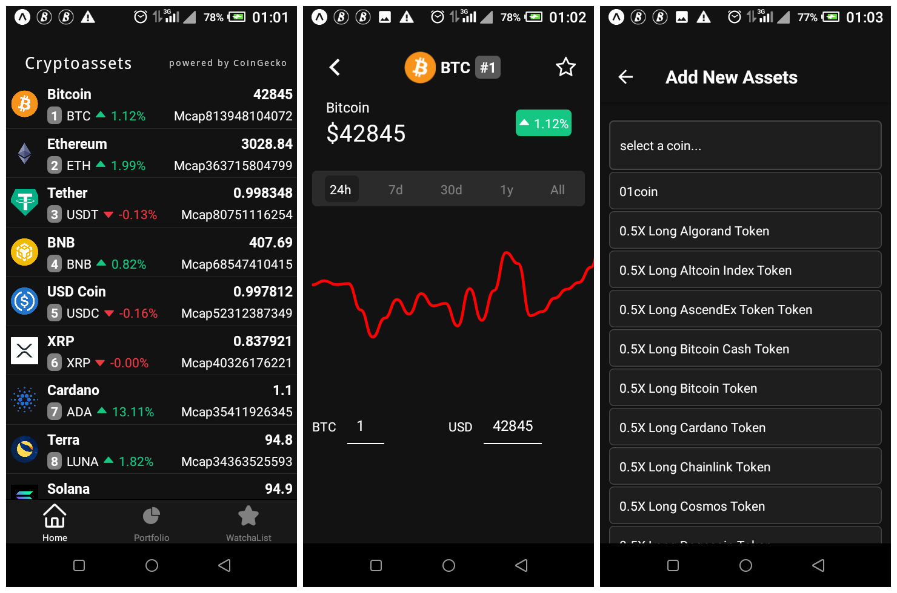
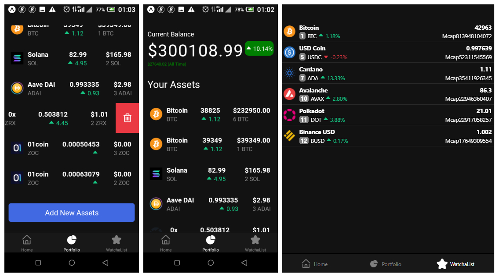

# Project Description

This cross-platform mobile application lets you see the current crypto price in real time and lets you track your crypto assets in your portfolio.
This app is optimized for different screen sizes and orientations.

#Installation

Please set up a React Native development environment if you have not already done so.
You will also need to import react-native-wagmi-charts for crypto charts.

import { LineChart } from 'react-native-wagmi-charts';

# Running iOS on a Mac via a simulator

Make sure you have a version of CocoaPods installed, and run the following commands:

npm i\
cd ios\
pod install\
cd ..\
npm react-native run-ios

# Running Android on a Mac or PC

Attach a device or run an emulator and run the following commands:

npm i\
npm react-native run-android

# Screenshots

# Ideas for Future Development
*Add a Splash Screen.\
*Add an app icon.
